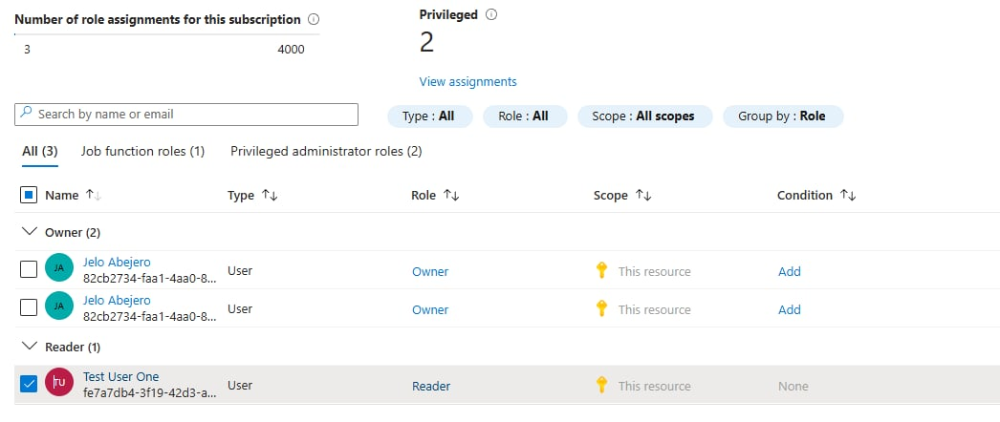

# User and RBAC Configuration in Azure

## Objective
To configure Azure identities and apply role-based access control following least-privilege principles.

## Tools Used
- Azure Portal
- Microsoft Entra ID (Azure AD)

## Steps Performed
1. Created test user in Entra ID
2. Assigned RBAC roles at the subscription level
3. Verified permissions through role assignments

## Outcome
- Restricted access based on assigned roles
- Reduced risk of unauthorized actions

## Security Concepts Learned
- Identity and Access Management (IAM)
- Role-Based Access Control (RBAC)
- Least Privilege

## Screenshots

### RBAC Role Assignment

