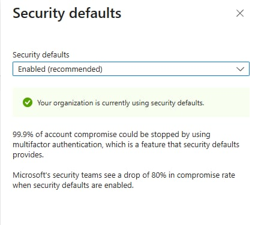

# Multi-Factor Authentication in Azure

## Objective
To improve account security by enforcing multi-factor authentication for Azure identities.

## Tools Used
- Microsoft Entra ID (Azure AD)
- Azure Portal

## Steps Performed
1. Enabled security defaults to enforce MFA
2. Reviewed available authentication methods
3. Verified MFA configuration in Entra ID

## Outcome
- Added an additional security layer to user authentication
- Reduced risk of credential-based attacks

## Security Concepts Learned
- Multi-Factor Authentication (MFA)
- Identity Protection
- Zero Trust Security Model
  
## Screenshot

