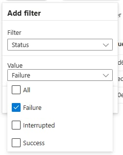
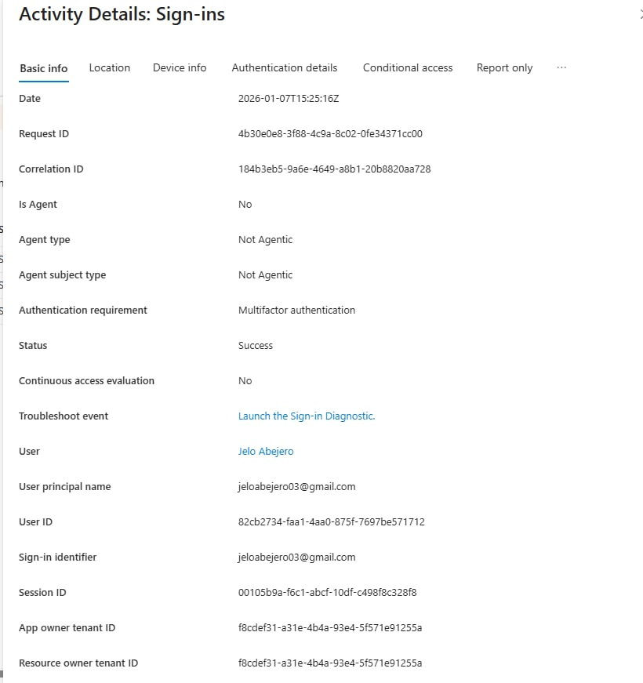
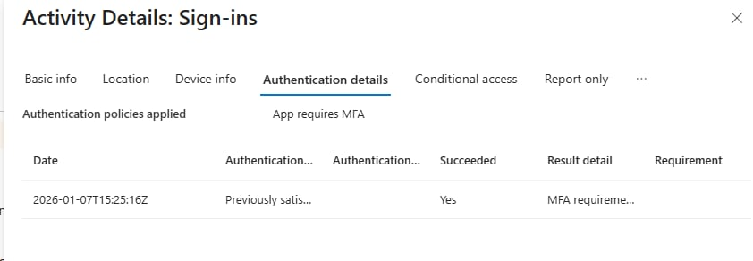

# Azure Sign-In Log Analysis

## Objective
To analyze Azure sign-in logs and identify authentication patterns, failures, and potential security risks.

## Tools Used
- Microsoft Entra ID
- Azure Sign-In Logs

## Steps Performed
1. Accessed Azure sign-in logs through Entra ID
2. Reviewed successful and failed authentication attempts
3. Applied filters to isolate failed sign-ins
4. Inspected authentication details and risk indicators

## Security Analysis
- Reviewed sign-in events for authentication status and access patterns
- No elevated risk indicators were observed during the review period
- Tenant did not display risk-based sign-in data, which is expected in a new environment

## Outcome
- Gained hands-on experience investigating authentication events
- Improved understanding of identity-based threat detection

## Security Concepts Learned
- Log analysis
- Authentication monitoring
- Basic incident investigation

## Screenshots

