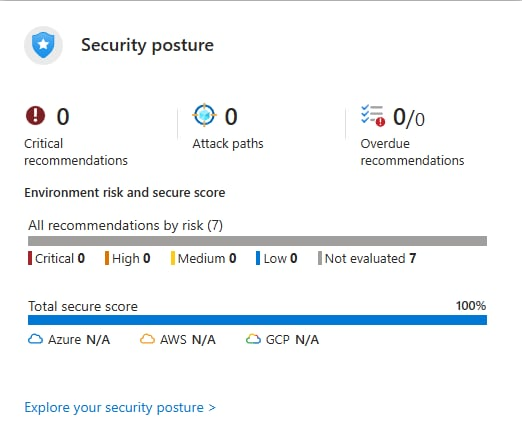

# Microsoft Defender for Cloud – Security Posture Review

## Objective
To review Azure security posture using Microsoft Defender for Cloud and understand common security recommendations.

## Tools Used
- Microsoft Defender for Cloud
- Azure Portal

## Steps Performed
1. Reviewed Secure Score dashboard
2. Analyzed security recommendations
3. Investigated risk descriptions and remediation guidance

## Security Analysis
- Identified common cloud security gaps such as missing MFA and unrestricted network access
- Reviewed how misconfigurations impact overall security posture
- Did not apply paid security plans or automated remediations

## Outcome
- Improved understanding of cloud security posture management
- Gained experience interpreting security recommendations

## Security Concepts Learned
- Cloud Security Posture Management (CSPM)
- Risk-based prioritization
- Misconfiguration management

## Screenshot

