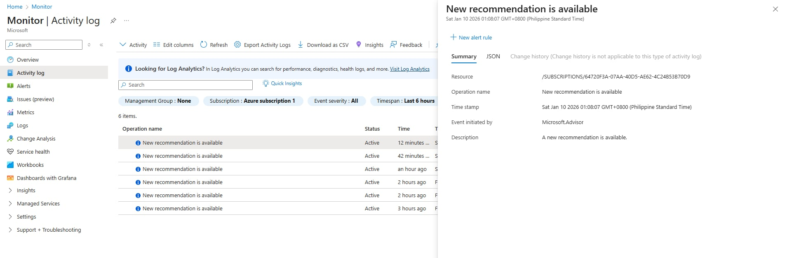

# Azure Activity Log Analysis

## Objective
To review Azure Activity Logs and understand how administrative actions are tracked for security and auditing purposes.

## Tools Used
- Azure Activity Log
- Azure Portal

## Steps Performed
1. Accessed Azure Activity Logs
2. Reviewed administrative events and operations
3. Analyzed event details including caller and timestamp

## Security Analysis
- Activity Logs provide visibility into changes made within the Azure environment
- These logs are essential for incident investigation and auditing

## Outcome
- Improved understanding of cloud activity monitoring
- Gained hands-on experience reviewing audit logs

## Security Concepts Learned
- Logging and monitoring
- Audit trails
- Incident investigation

## Screenshots

