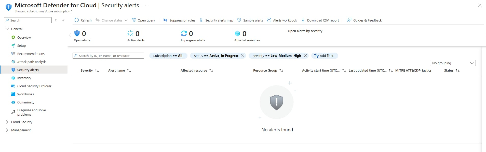

# Microsoft Defender for Cloud – Security Alerts

## Objective
To review Azure security alerts and understand how cloud-native threat detection works.

## Tools Used
- Microsoft Defender for Cloud

## Steps Performed
1. Accessed the Defender for Cloud security alerts dashboard
2. Reviewed available security alerts

## Security Analysis
- Security alerts highlight potential threats and misconfigurations
- Not all environments generate alerts immediately, especially new tenants

## Outcome
- Improved understanding of Azure threat detection capabilities
- Learned where to monitor for security incidents

## Security Concepts Learned
- Threat detection
- Cloud security monitoring

## Screenshots

