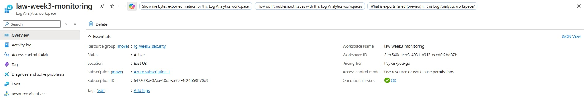

# Log Analytics Workspace Setup

## Objective
To create a centralized logging workspace for monitoring and security analysis.

## Tools Used
- Azure Log Analytics
- Azure Portal

## Steps Performed
1. Created a Log Analytics workspace
2. Configured workspace settings and region
3. Verified successful deployment

## Security Analysis
- Centralized logging improves visibility across cloud resources
- Log Analytics serves as a foundation for SIEM and incident response

## Outcome
- Successfully deployed a Log Analytics workspace
- Established a base for future security monitoring

## Security Concepts Learned
- Centralized logging
- Monitoring architecture
- SIEM fundamentals

## Screenshot

