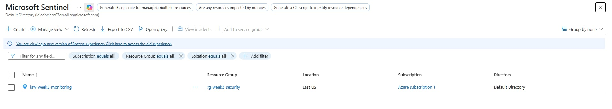

# Microsoft Sentinel Setup (SIEM)

## Objective
To enable Microsoft Sentinel and understand how SIEM platforms collect and analyze security data.

## Tools Used
- Microsoft Sentinel
- Azure Log Analytics

## Steps Performed
1. Opened Microsoft Sentinel in Azure Portal
2. Connected Sentinel to an existing Log Analytics workspace
3. Verified successful SIEM activation

## Security Analysis
- SIEM platforms centralize logs and alerts for investigation
- Sentinel enables detection, investigation, and response workflows

## Outcome
- Successfully enabled Microsoft Sentinel
- Gained hands-on exposure to a cloud-native SIEM

## Security Concepts Learned
- SIEM
- Security operations (SOC)
- Centralized monitoring

## Screenshot

