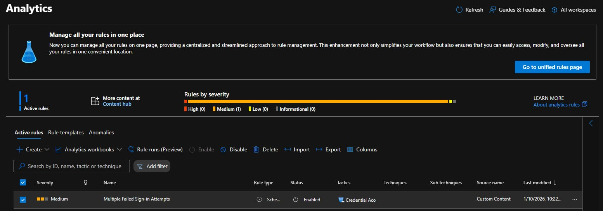

# Sentinel Analytics Rule – Failed Sign-In Detection

## Objective
To create a Microsoft Sentinel analytics rule that detects multiple failed Azure sign-in attempts.

## Tools Used
- Microsoft Sentinel
- Log Analytics Workspace
- Azure Sign-in Logs
- KQL (Kusto Query Language)

## Steps Performed
1. Created a scheduled analytics rule in Microsoft Sentinel
2. Used KQL to detect repeated failed sign-in attempts
3. Configured alert severity and incident creation
4. Enabled the rule for continuous monitoring

## Outcome
- Sentinel generates alerts for potential brute-force sign-in activity
- Security incidents are automatically created for investigation

## Security Concepts Learned
- SIEM detection rules
- Authentication threat detection
- Log-based alerting using KQL

 
 ## Screenshot Proof

