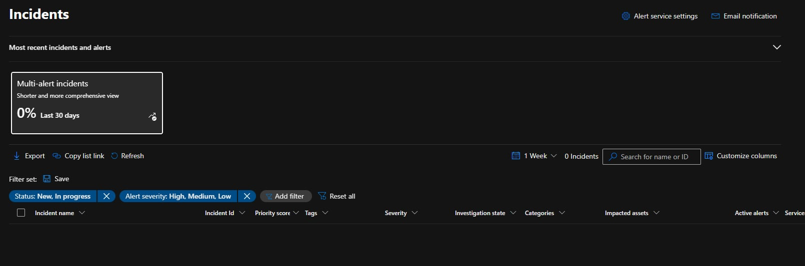

# Incident Investigation – Microsoft Sentinel

## Objective
To review and investigate security incidents generated by Microsoft Sentinel.

## Tools Used
- Microsoft Sentinel

## Steps Performed
1. Accessed the Incidents dashboard in Microsoft Sentinel
2. Reviewed incident status and availability
3. Confirmed detection rules were enabled

## Screenshot 

## Outcome
- No incidents were generated during the lab period
- Detection rules were verified as active

## Security Concepts Learned
- Incident lifecycle
- Relationship between logs, alerts, and incidents
- SIEM detection validation
